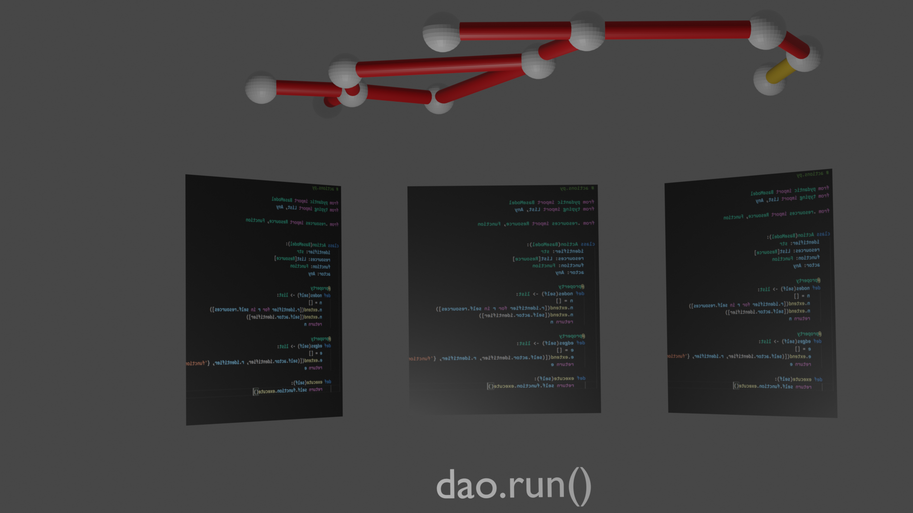

# Cotyl Visual DAO Framework
A community-driven framework and specification for constructing transparent DAOs on Cardano. 

Cotyl accomplishes this by bringing:

1. True to code visuals - A graph of agents and data flow through the DAO network.
2. On-Chain interoperability - built in support and libraries for communicating with Cardano infrastructure.
3. Local simulation - built in simulation engine for end to end testing.

## Overview Video

